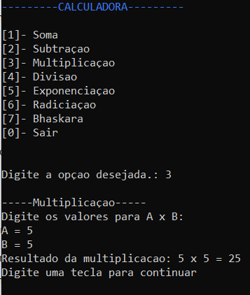

# PROJETO CALCULADORA

O projeto foi criado com o propósito de demonstrar o conhecimento adquirido ao longo do módulo em c#.

## Função

O software é uma calculadora que contém:

- As quatro operações aritméticas básicas (soma, subtração, multiplicação e divisão);

- Exponenciação e radiciação;

- Bhaskara.

## Programa 

[Site](https://ruttesilva.github.io/Projeto-calculadora/)

## Download

Baixe o arquivo abaixo. Descompacte na pasta desejada.

[Download do arquivo .zip](https://github.com/ruttesilva/Projeto-calculadora/raw/main/dist/ProjetoCalculadora.zip)

## Sobre

Me chamo Rutte, tenho 16 anos e esse programa foi realizado como projeto final da disciplina de programação em linguagem c#, no primeiro módulo de Informática da ETEC Adolpho Berezin :)

## Agradecimentos

- [ETEC Adolpho Berezin](https://eteab.com.br/cms/)
- [Ermogenes Palácio](https://github.com/ermogenes)
- [Diego Neri](https://github.com/diegoneri)